# LDM

[TOC]

## 背景:

扩散模型在图像生成上表现很好, 可以通过条件控制图像生成, 但是因为直接在像素空间运行, 导致模型的训练成本很大,并且推理生成的开销也很大.

扩散模型是由一系列降噪自编码器堆叠而成的, 目前在图像生成上表现很好, 甚至超越了此前图像生成的其它模型的表现, 在类条件图像生成, 图像超分辨率等任务上变成新的SOTA.而且无条件的扩散模型相比于其它生成模型可以更容易应用到编辑着色等任务上.扩散模型不会像GANs那样出现模式坍塌mode-collapse, 训练不稳定等,同时由于大量使用参数共享, 可以使用相对较少的参数来处理自然图像高度复杂的分布(在自回归模型中, 参数量通常是数十亿级的)

<a href="zotero://open-pdf/library/items/Z2AZZ32X?page=1&#x26;annotation=FR593CXK">“DMs belong to the class of likelihood-based models, whose mode-covering behavior makes them prone to spend excessive amounts of capacity (and thus compute resources) on modeling imperceptible details of the data”</a> (<a href="zotero://select/library/items/SCXBYWQZ">Rombach 等, 2022, p. 1</a>) DM 属于基于似然的模型类别，其模式覆盖行为使它们倾向于花费过多的容量（以及计算资源）来对难以察觉的数据细节进行建模.

但是, 扩散模型的表达能力有很大一部分用于处理数据难以觉察的细节, 同时扩散模型的训练和评估这需要在RGB图像的高维空间重复运行评估函数和梯度计算.以Diffusion Models Beat GAN为例, 训练过程大约需要150-1000个V100天,在单个A100GPU上产生50K个样本大约需要5天.对于研究社区和用户来说, 扩散模型训练和推理的高昂计算成本导致:

1.  训练这样一个模型需要非常大的计算资源, 只有少量的团队能做到(带来巨大的碳足迹,(环保主义???))
2.  评估训练好的模型在时间和内存上成本也非常高昂, 因为模型产生样本需要按顺序执行很多步(25-1000步)

因此, 需要一种更有效的方法能够大幅减少训练和采样所需的计算资源, 同时保持模型的性能不会变差.

针对像素空间已经训练好的扩散模型进行分析:<a href="zotero://open-pdf/library/items/Z2AZZ32X?page=2&#x26;annotation=23NQABU7">“As with any likelihood-based model, learning can be roughly divided into two stages: First is a perceptual compression stage which removes high-frequency details but still learns little semantic variation. In the second stage, the actual generative model learns the semantic and conceptual composition of the data (semantic compression).”</a> (<a href="zotero://select/library/items/SCXBYWQZ">Rombach 等, 2022, p. 2</a>) 与任何基于似然的模型一样，学习大致可以分为两个阶段：首先是感知压缩阶段，它会去除高频细节，但仍然学习很少的语义变化。在第二阶段，实际的生成模型学习数据的语义和概念组成（语义压缩）。

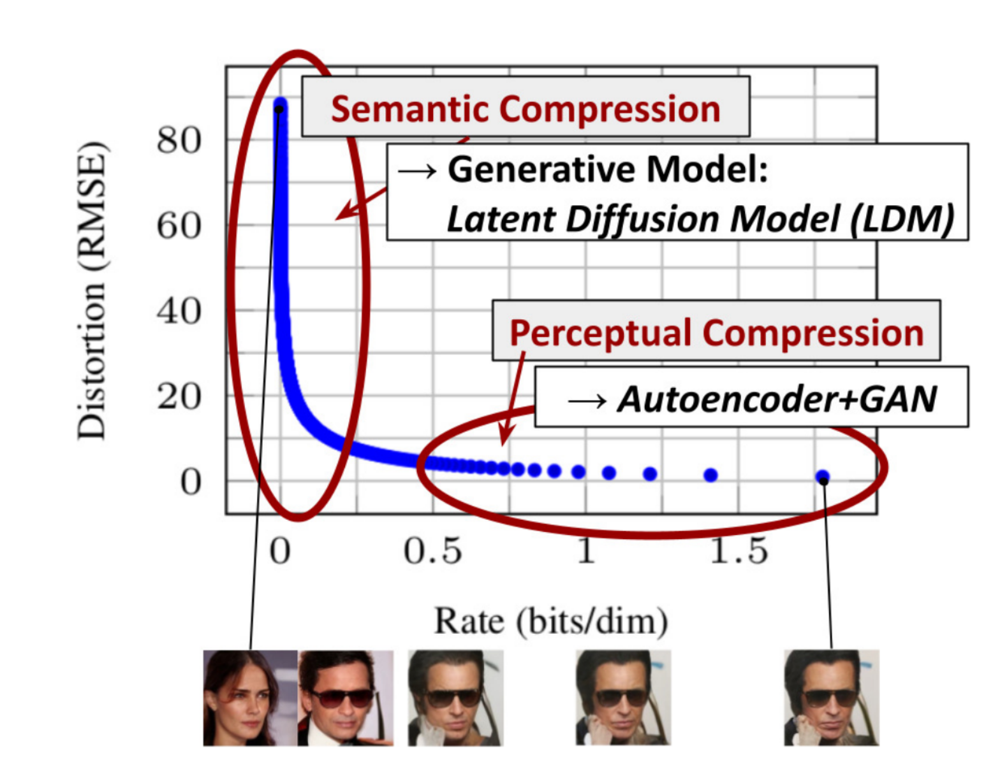

<a href="zotero://open-pdf/library/items/Z2AZZ32X?page=2">“Illustrating perceptual and semantic compression: Most bits of a digital image correspond to imperceptible details. While DMs allow to suppress this semantically meaningless information by minimizing the responsible loss term, gradients (during training) and the neural network backbone (training and inference) still need to be evaluated on all pixels, leading to superfluous computations and unnecessarily expensive optimization and inference. We propose latent diffusion models (LDMs) as an effective generative model and a separate mild compression stage that only eliminates imperceptible details. ---- 说明感知和语义压缩：数字图像的大部分bits对应于难以察觉的细节。虽然 DM 允许通过最小化损失项来抑制这种语义上无意义的信息，但梯度（在训练期间）和神经网络主干（训练和推理）仍然需要在所有像素上进行评估，从而导致多余的计算和不必要的昂贵的优化和推理.我们建议将潜在扩散模型 (LDM) 作为有效的生成模型和单独的仅消除难以察觉的细节的温和压缩阶段。”</a> (<a href="zotero://select/library/items/SCXBYWQZ">Rombach 等, 2022, p. 2</a>)

前面提及过, 扩散模型很大一部分表达能力用在了感知压缩阶段, 处理很多难以察觉的对理解图像语义概念不重要的细节.

<a href="zotero://open-pdf/library/items/Z2AZZ32X?page=2&#x26;annotation=98HV5CL6">“We thus aim to first find a perceptually equivalent, but computationally more suitable space, in which we will train diffusion models for high-resolution image synthesis.”</a> (<a href="zotero://select/library/items/SCXBYWQZ">Rombach 等, 2022, p. 2</a>) 因此，我们的目标是首先找到一个感知上等效但计算上更合适的空间，我们将在其中训练用于高分辨率图像合成的扩散模型。

<a href="zotero://open-pdf/library/items/Z2AZZ32X?page=2&#x26;annotation=5RACPPKY">“we separate training into two distinct phases: First, we train an autoencoder which provides a lower-dimensional (and thereby efficient) representational space which is perceptually equivalent to the data space.”</a> (<a href="zotero://select/library/items/SCXBYWQZ">Rombach 等, 2022, p. 2</a>) 我们将训练分为两个不同的阶段：首先，我们训练一个自动编码器，它提供一个低维（因此有效）的表示空间，在感知上等同于数据空间。

在这个学到的感知空间上训练扩散模型, 这在空间维度上表现出更好的缩放特性, 降低复杂性, 特征空间上更有效的图像生成.DALL E(66), VQ-GAN(23)

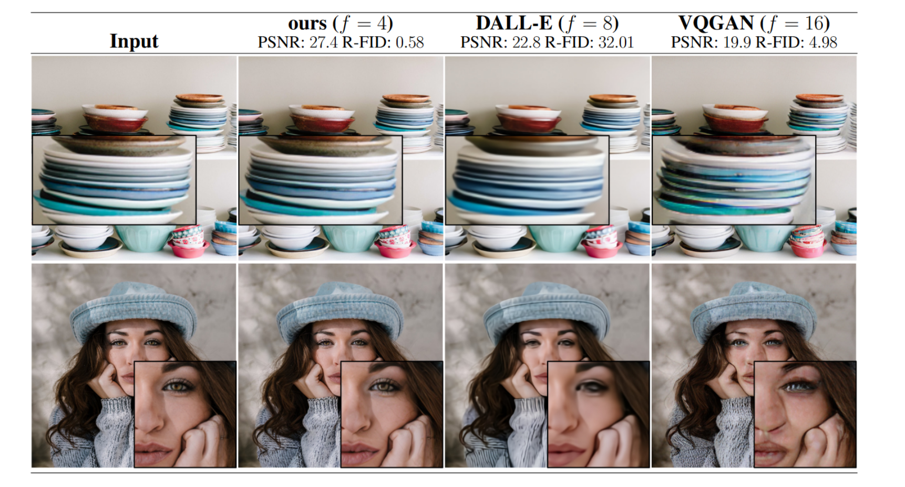  

<a href="zotero://open-pdf/library/items/Z2AZZ32X?page=1">“Figure 1. Boosting the upper bound on achievable quality with less agressive downsampling. Since diffusion models offer excellent inductive biases for spatial data, we do not need the heavy spatial downsampling of related generative models in latent space, but can still greatly reduce the dimensionality of the data via suitable autoencoding models, see Sec. 3. Images are from the DIV2K [1] validation set, evaluated at 5122 px. We denote the spatial downsampling factor by f . Reconstruction FIDs [29] and PSNR are calculated on ImageNet-val. [12]; see also Tab. 8. ---- 图 1. 通过不太激进的下采样提高可实现质量的上限。由于扩散模型为空间数据提供了极好的归纳偏差，我们不需要在潜在空间中对相关生成模型进行大量的空间下采样，但仍然可以通过合适的自动编码模型大大降低数据的维数，参见第 3节. 图像来自 DIV2K [1] 验证集，以 512像素评估。我们用 f 表示空间下采样因子。重建 FID [29] 和 PSNR 是在 ImageNet-val 上计算的。 [12];另见选项卡。 8.”</a> (<a href="zotero://select/library/items/SCXBYWQZ">Rombach 等, 2022, p. 1</a>)

这种分阶段的方法一个显著的优势是, 训练产生感知空间的自编码器可以重用, 可以在得到的感知空间上运行多种扩散模型,或者运行其它完全不同的任务.(auto-encoder产生的中间特征表示可以用于识别检测等下游任务)

论文的insights体现在下面两个方面:

1.  在和数据空间感知上等价的特征空间训练扩散模型, 在保持模型表现的情况下, 训练的成本更低, 推理速度更快;
2.  在扩散模型中引入交叉注意力层, 可以灵活有效处理不同类型的条件信息输入.

## 方法:

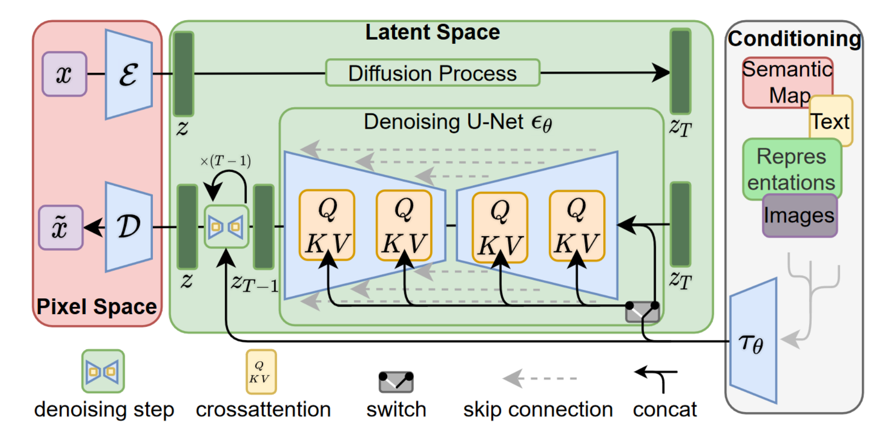

如前面所述, LDM的训练过程分为两个阶段,首先, 训练一个自编码器处理难以感知的细节, 得到一个和数据空间等价的压缩的(低维有效)的感知空间(latent space); 然后在latent space上扩散模型, 学习数据的语义和概念.LDM在latent space 通过扩散模型对随机噪声不断降噪, 得到包含语义的特征,然后将产生的包含语义的特征送入解码器解码得到生成的图像.

下面展开介绍上图中模型的三部分, 感知图像压缩, 扩散模型和交叉注意力机制

### 感知压缩

感知压缩模型基于VQGAN, 通过感知损失和基于patch的对抗目标训练的自编码器, 只使用L1或L2损失会导致模糊:

<a href="zotero://open-pdf/library/items/Z2AZZ32X?page=3&#x26;annotation=XE8Q8NSH">“This ensures that the reconstructions are confined to the image manifold by enforcing local realism and avoids bluriness introduced by relying solely on pixel-space losses such as L2 or L1 objectives.”</a> (<a href="zotero://select/library/items/SCXBYWQZ">Rombach 等, 2022, p. 3</a>) 这确保了通过强制局部真实性将重建限制在图像流形中，并避免仅依靠像素空间损失（例如 L2 或 L1 目标）引入的模糊。

对于RGB空间的图像$x \in \mathbb{R}^{H \times W \times 3}$ , encoder $\mathcal{E}$ 将$x$ 编码为隐含表示为$z=\mathcal{E}(x),z \in \mathbb{R}^{h \times w \times c}$ ,decoder $\mathcal{D}$ 从隐含表示$z$ 重建图像$\tilde{x}=\mathcal{D}(z)=\mathcal{D}(\mathcal{E}(x))$ .encoder通过采样因子$f=H / h=W / w$对图像进行下采样, 作者在后面做了实验探究不同下采样因子$f=2^m,m\in\mathbb{N}$对模型性能的影响.

自编码模型的训练按照VQ-GAN的方式, 使用一个基于patch的判别器Discriminator $D_{\psi}$ 来优化原始图像$x$ 和重建图像$\mathcal{D}(\mathcal{E}(x))$ 之间的差异; 为了避免任意缩放潜在空间, 将潜在的$z$ 正则化为以零为中心并通过引入正则误差项$L_{reg}$ 来获得小方差.

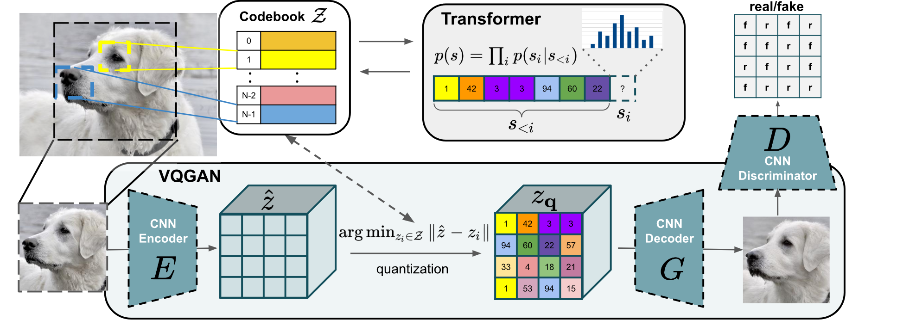

为了防止在潜在空间的任意的高方差, 压缩模型使用了两种正则化方法,并设计实验比较两种方法的表现:

1.  KL正则, 和VAE相似, 对学到的潜在变量分布$q_{\mathcal{E}}(z \mid x)=\mathcal{N}\left(z ; \mathcal{E}_{\mu}, \mathcal{E}_{\sigma^{2}}\right)$添加微小的标准正态分布

    $\mathcal{N}(z ; 0,1)$惩罚;

2.  VQ正则, 在decoder中使用一个VQ层, 此时感知压缩模型和VQ-GAN很像(VQ-GAN的VQ层在encoder和decoder之间, 而此时VQ层被融入到decoder)

为了获得更高质量的重建, 对于这两种场景使用非常小的正则系数, KL正则的权重因子大约是$10^{-6}$ , VQ正则通常选择一个高维度的codebook.,用于压缩的自编码模型的完整的目标函数如下:

$$
\begin{equation}
L_{\text {Autoencoder }}=\min _{\mathcal{E}, \mathcal{D}} \max _\psi\left(L_{r e c}(x, \mathcal{D}(\mathcal{E}(x)))-L_{a d v}(\mathcal{D}(\mathcal{E}(x)))+\log D_\psi(x)+L_{r e g}(x ; \mathcal{E}, \mathcal{D})\right)
\end{equation}
$$

目标函数包括三部分, 第一部分是重建误差, 第二部分是对抗误差, 第三部分是正则项. 重建误差通过比较原始图像和重建图像的感知损失; 对抗误差使用的基于patch的对抗损失:

$$
\min _G \max _D V(D, G)=\mathbb{E}_{\boldsymbol{x} \sim p_{\text {data }}(\boldsymbol{x})}[\log D(\boldsymbol{x})]+\mathbb{E}_{\boldsymbol{z} \sim p_{\boldsymbol{z}}(\boldsymbol{z})}[\log (1-D(G(\boldsymbol{z})))]
$$

这里使用了原始GAN论文中提及的训练初期饱和的调整后的形式:

<a href="zotero://open-pdf/library/items/TSFHIZGD?page=3&#x26;annotation=ZMCCMYL7">“In practice, equation 1 may not provide sufficient gradient for G to learn well. Early in learning, when G is poor, D can reject samples with high confidence because they are clearly different from the training data. In this case, log(1 − D(G(z))) saturates. Rather than training G to minimize log(1 − D(G(z))) we can train G to maximize log D(G(z)). This objective function results in the same fixed point of the dynamics of G and D but provides much stronger gradients early in learning.”</a> (<a href="zotero://select/library/items/X5RTH3BN">Goodfellow 等, 2014, p. 3</a>) 实际上，等式 1 可能无法为 G 提供足够的梯度来很好地学习。在学习早期，当 G 较差时，D 可以拒绝具有高置信度的样本，因为它们明显不同于训练数据。在这种情况下，log(1 − D(G(z))) 饱和。我们可以训练 G 来最大化 log D(G(z))，而不是训练 G 来最小化 log(1 − D(G(z)))。这个目标函数导致 G 和 D 的动力学有相同的不动点，但在学习的早期提供了更强的梯度。

为了在学到的latent space上训练扩散模型, 在学习$p(z), p(z|y)$ 时也要分两种情况:

1.  使用KL正则, 采样$z=\mathcal{E}_\mu(x)+\mathcal{E}_\sigma(x) \cdot \varepsilon=: \mathcal{E}(x),\varepsilon\in\mathcal{N}(0,1)$ 需要对Encoder$\mathcal{E}$ 的输出进行缩放使得潜在变量具有单位标准差$z \leftarrow \frac{z}{\hat{\sigma}}=\frac{\mathcal{E}(x)}{\hat{\sigma}}$,  从数据的第一个batch中估计分量均值和方差:

    $$
    \hat{\sigma}^2=\frac{1}{b c h w} \sum_{b, c, h, w}\left(z^{b, c, h, w}-\hat{\mu}\right)^2,
    \\
    \hat{\mu}=\frac{1}{b c h w} \sum_{b, c, h, w}z^{b, c, h, w}
    $$

2.  对于VQ正则化, 在进入VQ层之前抽取$z$(相比之下VQGAN则是VQ层的输出进行抽取),VQ层作为decoder的第一层融入decoder中.

此前的一些研究比如VQ-GAN, DALL E也尝试在特征空间上运行扩散模型, 来学习数据的语义分布, 通过自回归的方式产生样本的特征, 但是它们是在高度压缩的离散特征空间上进行的, 原本连续的特征被离散化为一些条目的一维序列排列, 导致包含在原本特征中的二维结构信息丢失, 作者认为保留这些特征的二维结构可以更好的保存$x$ 的信息,从而更好的重建$x$ .

训练的感知压缩模型去除了原有数据空间高频难以察觉的细节,得到了低维有效的特征空间, 在感知上和原有数据空间等价,和原来的高维像素空间相比, 当前的空间更适合基于似然的生成模型, 可以专注于数据中重要的包含语义信息的bit, 在低维空间中训练, 成本更低.

### 扩散模型

扩散模型可以看做是权重相同的序列降噪自编码器的堆叠, 每个降噪自编码器训练预测对于原始图像包含噪声的输入去噪结果的预测, 扩散模型最基本的目标函数是:

$$
L_{D M}=\mathbb{E}_{x, \epsilon \sim \mathcal{N}(0,1), t}\left[\left\|\epsilon-\epsilon_\theta\left(x_t, t\right)\right\|_2^2\right]
$$

关于这部分推导, 它放在附录B中, 和扩散模型的推导相同, 但是它这里使用<a href="zotero://open-pdf/library/items/Z2AZZ32X?page=16">“signal-to-noise ratio SNR(t)”</a> (<a href="zotero://select/library/items/SCXBYWQZ">Rombach 等, 2022, p. 16</a>)这个概念,最后得到的降噪目标函数如下:

$$
\left\|x_0-x_\theta\left(\alpha_t x_0+\sigma_t \epsilon, t\right)\right\|^2=\frac{\sigma_t^2}{\alpha_t^2}\left\|\epsilon-\epsilon_\theta\left(\alpha_t x_0+\sigma_t \epsilon, t\right)\right\|^2
$$

每一项的权重和不同时间步的信噪比有关, 给每一步目标的函数使用相同的权重,进一步简化目标函数.

LDM模型包含一些与图像相关的归纳偏置, 比如从2D卷积层构建底层Unet, 使用重新加权的边界进一步将目标集中在最相关bit的感知上, LDM在latent sapce上扩散模型的目标是:

$$
L_{L D M}:=\mathbb{E}_{\mathcal{E}(x), \epsilon \sim \mathcal{N}(0,1), t}\left[\left\|\epsilon-\epsilon_{\theta}\left(z{t}, t\right)\right\|_{2}^{2}\right]
$$

模型主干$\epsilon_{\theta}(\circ, t)$ 由时间条件的UNet实现.由于前向过程是固定的, 在训练中$z_t$ 可以从$\mathcal{E}$ 中高效获得, 而在采样时, 从$p(z)$ 得到的样本也只需要经过$\mathcal{D}$ 一遍,就可以解码到图像空间.

### 条件机制

使用条件去噪自动编码器$\epsilon_{\theta}(z_{t},{t},y)$来实现通过条件信息输入$y$ 控制图像的合成, 条件信息包括文本, 语义图以及其它图像到图像转换任务.

目前用扩散模型来处理单一类别标签,模糊图像输入之外的其它条件信息的研究并不是很多, 为了实现扩散模型更灵活的处理条件信息, 对底层的UNet骨干网络做修改, 引入交叉注意力机制, 可以有效处理多种条件输入.对于多种类型的条件信息, 引入一个针对该条件信息类型的编码器$\tau_{\theta}$ , 将条件信息输入$y$ 投影为中间表示$\tau_{\theta}(y)\in\mathbb{R}^{M\times d_{\tau}}$ ,然后通过交叉注意力层映射到UNet的中间层做注意力计算:

$$
\quad\text{Atention}(Q,K,V)=\text{softmax}\left(\frac{QK^T}{\sqrt{d}}\right)\cdot V \\
\begin{aligned}Q=W_{Q}^{(i)}\cdot\varphi_{i}(z_{t}),K=W_{K}^{(i)}\cdot\tau_{\theta}(y),V=W_{V}^{(i)}\cdot\tau_{\theta}(y)\end{aligned}
$$

其中$\varphi_i(z_t)\in\mathbb{R}^{N\times d_\epsilon^i}$ 表示UNet实现$\epsilon_\theta$ 的展平的中间表示, $W_{V}^{(i)}\in \mathbb{R}^{d\times d_\epsilon^i},W_Q^{(i)}\in\mathbb{R}^{d\times d_\tau}\text{\&}\ W_K^{(i)}\in\mathbb{R}^{d\times d_\tau}$ 是可以学习的投影矩阵(多头注意力???)

带有条件的扩散模型的目标函数为:

$$
L_{LDM}:=\mathbb{E}_{\mathcal{E}(x),y,\epsilon\sim\mathcal{N}(0,1),t}\Big[\|\epsilon-\epsilon_\theta(z_t,t,\tau_\theta(y))\|_2^2\Big]
$$

$\tau_\theta, \epsilon_\theta$ 是模型的参数, 由上面的目标函数优化, 这种条件机制非常灵活, 因为$\tau_\theta$ 可以是在其它设计的非常好的模型,更有效的提取信息.

在这篇文章中的text2image和layout2image实验中, 通过一个没有掩码的transformer(Encoder)来实现条件编码器$\tau_\theta$ , 对 tokenized的条件输入$y$ 进行处理产生一个输出$\zeta:=\tau_{\theta}(y),\zeta\in\mathcal{R}^{M\times d_\tau}$, transformer通过$N$ 个transformer块构成, 每个transformer块包含全局自注意力层, 层归一化和position-wise MLPs, transformer按如下方式构建:

$$
\begin{align*}
&\zeta \leftarrow \text{TokEmb}(y) + \text{PosEmb(y)} \\
%
&\text{for } i=1,\dots,N:  \\
 &\quad \zeta_1 \leftarrow \text{LayerNorm}(\zeta) \\
 &\quad \zeta_2 \leftarrow \text{MultiHeadSelfAttention}(\zeta_1) + \zeta \\
 &\quad \zeta_3 \leftarrow \text{LayerNorm}(\zeta_2)  \\
 &\quad \zeta \leftarrow \text{MLP}(\zeta_3) + \zeta_2  \\ 
& \zeta \leftarrow \text{LayerNorm}(\zeta)  \\
\end{align*}
$$

当$\zeta$ 可用时, 按模型图描述的那样, 通过交叉注意力机制,条件信息被映射到UNet中, 对原来的UNet网络进行修改, 替换之前的自注意力层为无掩码的transformer, transformer由$T$ 个Transformer块构成, 每个块包括自注意力, position-wsize MLP和交叉注意力子层,修改后的UNet网络结构如下表所示:

在text2image实验中,使用的文本编码器$\tau_\theta$ 是bert, layout2image模型将边界框的空间位置信息离散化,编码为三元组$(l,b,c)$ , $l$ 表示左上角,$b$ 表示右下角, $c$ 表示包含的类别信息.

感知压缩实验中使用的类条件模型也是通过交叉注意力实现的, 其中的$\tau_\theta$ 是单个512维的可学习的embedding层,映射类别信息$y\to\zeta\in\mathbb{R^{1\times512}}$

## 实验

### 感知压缩的折中

在下采样系数$f\in\{1, 2, 4, 8, 16, 32\}$ 情况下训练模型并比较性能, $f=0$是在像素空间训练扩散模型, 所有的训练和评估都在单张A100上进行, 模型的参数量和训练的步骤相同.

这里在OpenImages上训练, 在ImageNet-Val数据集上评估以及超参数对模型影响的结果:

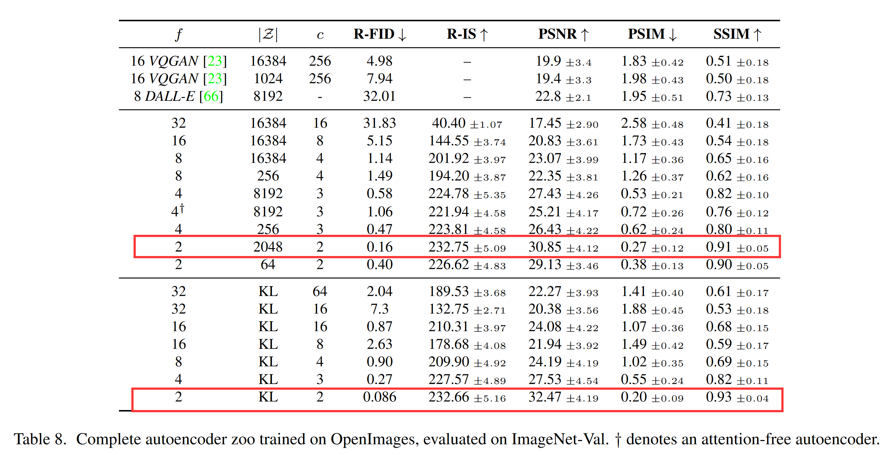

针对不同的下采样系数, 分别做了使用不同正则的结果, 在相同采样系数下,KL正则在第一阶段重建模型评估的指标上比VQ正则效果更好,但是作者也提及使用VQ正则采样的样本通常质量会更好:

<a href="zotero://open-pdf/library/items/Z2AZZ32X?page=5">“Interestingly, we find that LDMs trained in VQregularized latent spaces sometimes achieve better sample quality, even though the reconstruction capabilities of VQregularized first stage models slightly fall behind those of their continuous counterparts, cf . Tab. 8. ---- 有趣的是，我们发现在 VQ 正则化潜在空间中训练的 LDM 有时会获得更好的样本质量，即使 VQ 正则化第一阶段模型的重建能力略微落后于它们的连续模型，参见 .标签。 8.”</a> (<a href="zotero://select/library/items/SCXBYWQZ">Rombach 等, 2022, p. 5</a>)

不同下采样系数模型在ImageNet数据集训练2M步, 这里模型所用的超参数:

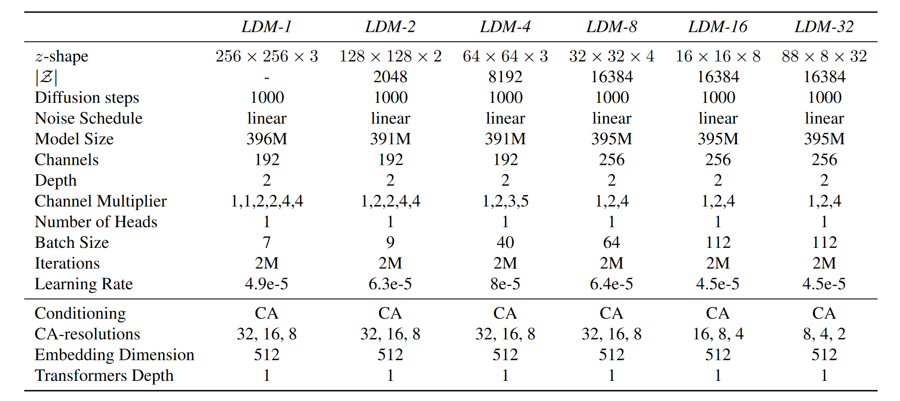

采样的质量如下图所示:

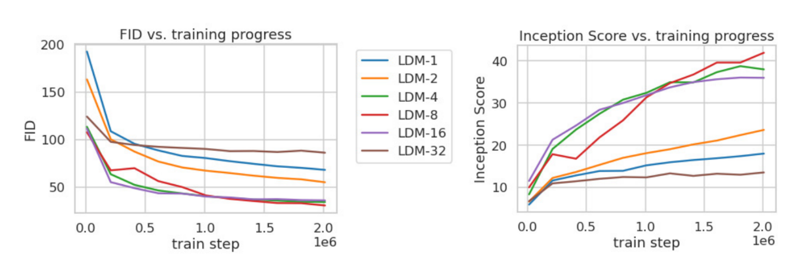

<a href="zotero://open-pdf/library/items/Z2AZZ32X?page=6">“Figure 6. Analyzing the training of class-conditional LDMs with different downsampling factors f over 2M train steps on the ImageNet dataset. Pixel-based LDM-1 requires substantially larger train times compared to models with larger downsampling factors (LDM-{4-16}). Too much perceptual compression as in LDM-32 limits the overall sample quality. All models are trained on a single NVIDIA A100 with the same computational budget. Results obtained with 100 DDIM steps [84] and κ = 0. ---- 图 6. 分析在 ImageNet 数据集上超过 2M 训练步骤的具有不同下采样因子 f 的类条件 LDM 的训练。与具有较大下采样因子的模型 (LDM-{4-16}) 相比，基于像素的 LDM-1 需要更长的训练时间。 LDM-32 中过多的感知压缩限制了整体样本质量。所有模型都在具有相同计算预算的单个 NVIDIA A100 上进行训练。使用 100 个 DDIM 步骤 [84] 和 κ = 0 获得的结果。”</a> (<a href="zotero://select/library/items/SCXBYWQZ">Rombach 等, 2022, p. 6</a>)

小的下采样系数$\{1, 2\}$ 通常导致训练过程更缓慢; 过大的下采样系数则在模型训练一些步之后保真度停滞.作者认为原因是:1. 将大部分感知压缩留给扩散模型了(对应下采样因子较小的情况); 2. 第一阶段压缩太强导致信息丢失, 从而限制了扩散模型的表现(过大的下采样系数).相比之下$\{4, 8, 16\}$,则在训练的效率和感知上忠实的结果之间保持了很好的平衡.

使用不同的下采样系数训练第一阶段的模型, 然后在训练好的感知压缩模型上使用DDIM进行采样, 比较不同数量的采样步(采样速率)产生的样本的质量. 下图是结果, 横轴表示吞吐量, 每条产生的样本的个数, 吞吐量越大,表示每秒产生的样本越多, 对应使用更少的采样步数.可以看到下采样系数为$\{4, 8\}$ 训练得到的第一阶段的模型表现更好, 有更低的FID分数,产生的样本质量更好.对于像ImageNet这样复杂的数据集, 需要降低压缩率以减少丢失信息降低模型的表现.

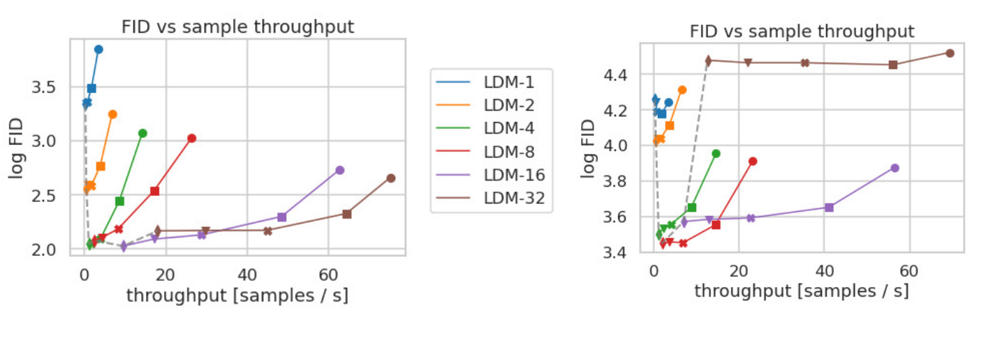

<a href="zotero://open-pdf/library/items/Z2AZZ32X?page=6">“Figure 7. Comparing LDMs with varying compression on the CelebA-HQ (left) and ImageNet (right) datasets. Different markers indicate {10, 20, 50, 100, 200} sampling steps using DDIM, from right to left along each line. The dashed line shows the FID scores for 200 steps, indicating the strong performance of LDM{4-8}. FID scores assessed on 5000 samples. All models were trained for 500k (CelebA) / 2M (ImageNet) steps on an A100. ---- 图 7. 在 CelebA-HQ（左）和 ImageNet（右）数据集上比较具有不同压缩率的 LDM。不同的标记表示使用 DDIM 的 {10, 20, 50, 100, 200} 采样步骤，从右到左沿着每条线。虚线显示了 200 步的 FID 分数，表明 LDM{4-8} 的强大性能。 FID 分数评估了 5000 个样本。所有模型都在 A100 上接受了 500k (CelebA) / 2M (ImageNet) 步数的训练。”</a> (<a href="zotero://select/library/items/SCXBYWQZ">Rombach 等, 2022, p. 6</a>)

比较了不同下采样系数第一阶段模型在固定时间(35个V100天)训练过程中的表现:

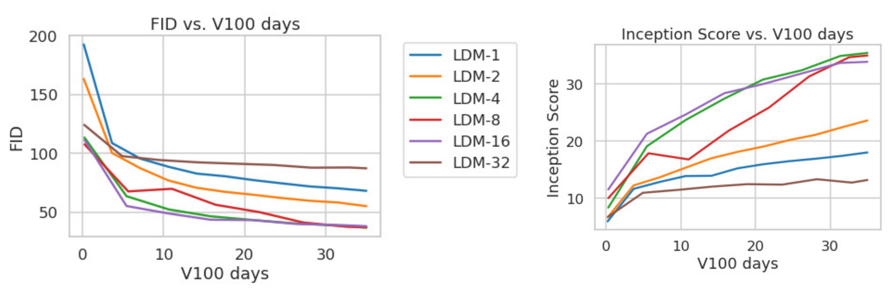

### 无条件生成

在CelebA-HQ, FFHQ, LSUN-Churches和 LSUN-Bedrooms四个数据集上进行训练和评估,这是不同数据集上模型的超参数:

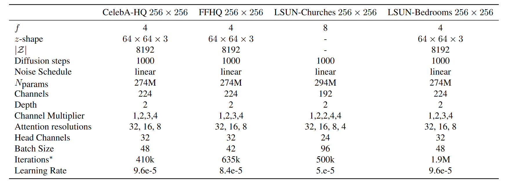

对采样质量和FID, Precision-and-Recall对数据流型的覆盖.结果如下图:

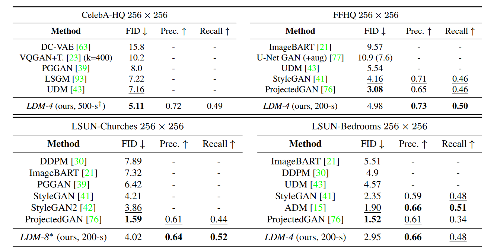

<a href="zotero://open-pdf/library/items/Z2AZZ32X?page=6">“Table 1. Evaluation metrics for unconditional image synthesis. CelebA-HQ results reproduced from [43, 63, 100], FFHQ from [42, 43]. †: N -s refers to N sampling steps with the DDIM [84] sampler. ∗: trained in KL-regularized latent space. Additional results can be found in the supplementary. ---- 表 1. 无条件图像合成的评估指标。 CelebA-HQ 结果来自 [43, 63, 100]，FFHQ 来自 [42, 43]。 †：N -s 指的是 DDIM [84] 采样器的 N 个采样步骤。 ∗：在 KL 正则化潜在空间中训练。其他结果可以在补充中找到。”</a> (<a href="zotero://select/library/items/SCXBYWQZ">Rombach 等, 2022, p. 6</a>)

这里提及了LSGM, 也是一个在latent space训练扩散模型的研究, 和作者的研究有一些相似, 然后指出和LSGM的不同:在固定空间中训练扩散模型，避免了权重重建质量与学习潜在空间先验的困难(LSGM还未来得及阅读).除了LSUN-Bedrooms数据集之外, 在另外三个数据集上的表现都优于基于扩散模型的方法, 表现和ADM相似, 但是只有它一半的参数量和训练时间减少了4倍.

关于效率分析, 作者在附录E3.5提及, 对于图6, 7, 17中的结果是基于5k个样本计算的, 结果可能和表1,表10不一样.所有的模型都具有表13和表14提供的可比较数量的参数. 最大化单个模型的学习率, 以便它们仍然可以稳定训练, 因此学习率和表13, 14中的可能有所不一样.

### 条件生成

#### class-conditional

在ImageNet数据集上训练类别条件的模型,由前面的实验可知, 在ImageNet上下采样系数为$\{4, 8\}$模型的表现更好, 生成的结果比目前扩散模型SOTA ADM更好,同时使用的计算资源和参数更少.

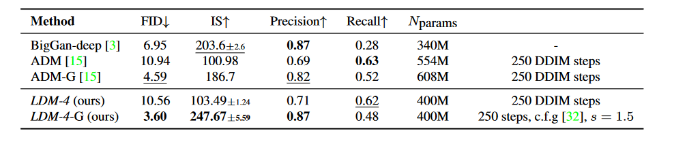

###

#### text-to-image

在LAION-400M数据集上训练使用KL正则参数量为1.45B使用文本做条件的LDM,模型的主要结构在前一节条件生成中有介绍, 这是采样生成的结果:

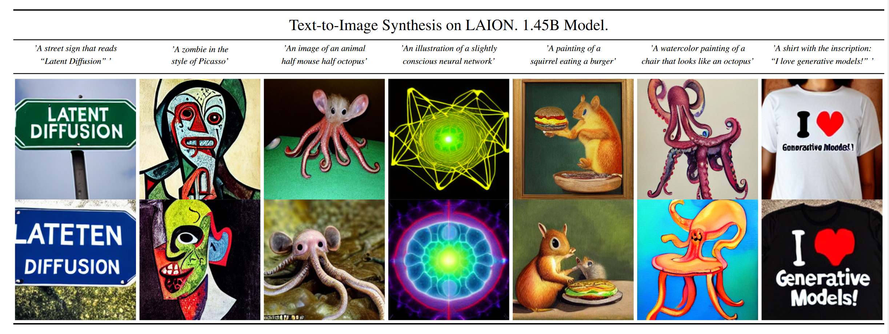

我尝试通过DALL E, huggingface和DreamStudio上使用同样的文本, 但是产生的图像和上面还是有一些差异:

这个是[DALL E](https://labs.openai.com/e/8bMHyyw9FYOmultdVIsOW4JW)产生的结果:

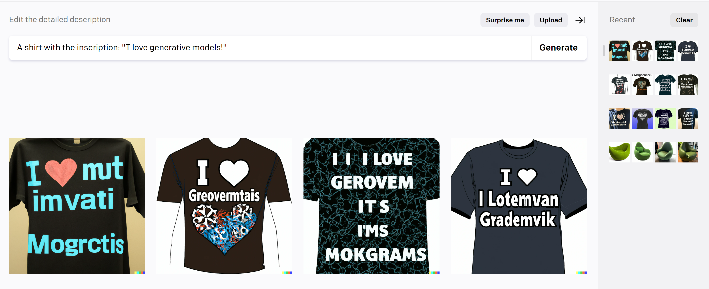

这个是huggingface上[CompVis](https://huggingface.co/CompVis/stable-diffusion-v1-4?text=A+shirt+with+the+inscription%3A+%22I+love+generative+models%21%22)提供的Stable Diffusion产生的结果:

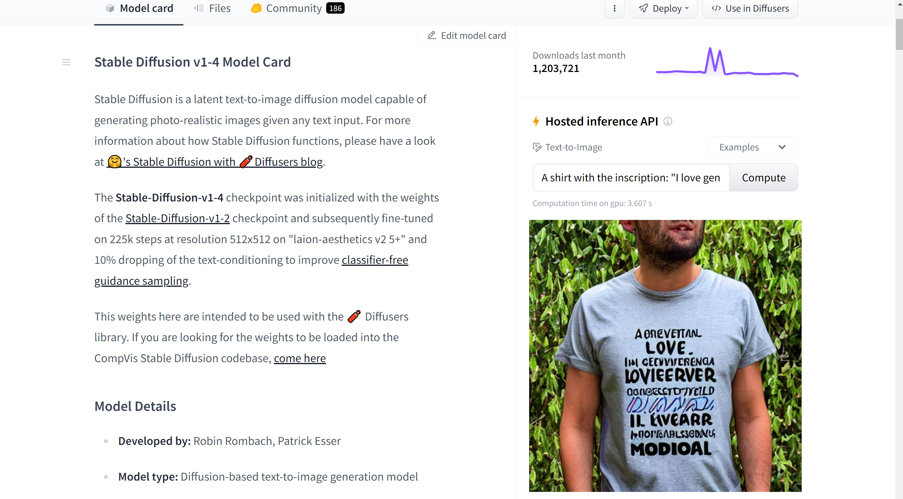

这是另外一个Stable Diffusion产生的结果:

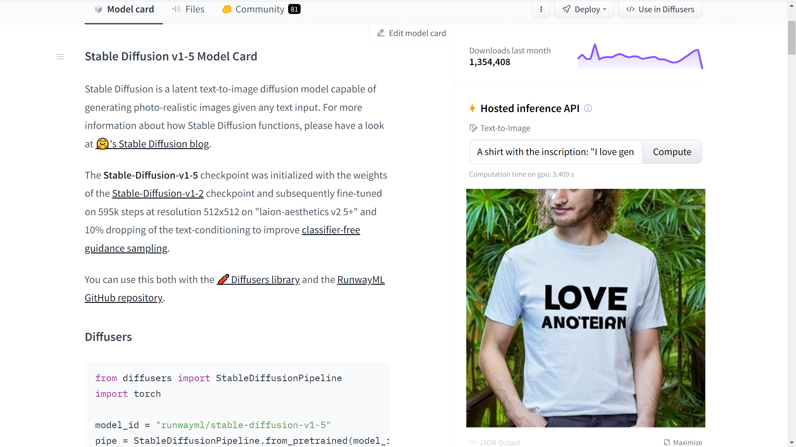

在[DreamStudio](https://beta.dreamstudio.ai/dream)上也使用相同的文本生成图像:

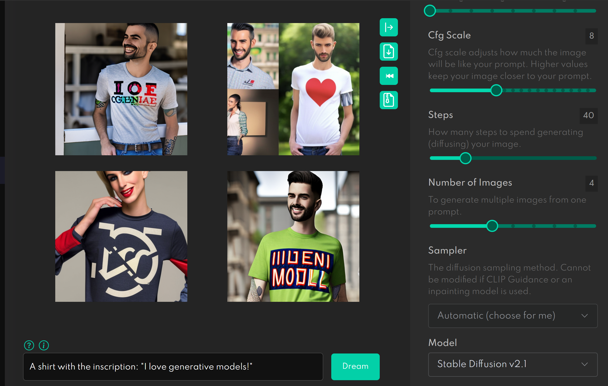

细节还是差了一些.

不过在huggingface上使用它们提供的[LDM](https://huggingface.co/spaces/multimodalart/latentdiffusion)生成的和论文中的基本相似:

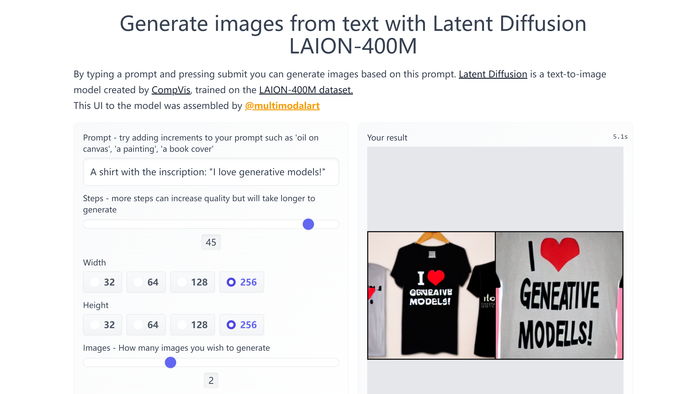

为了定量评估, 按照此前的研究在MS-COCO验证集上评估text2image, 改进了基于自回归和GAN的方法:\
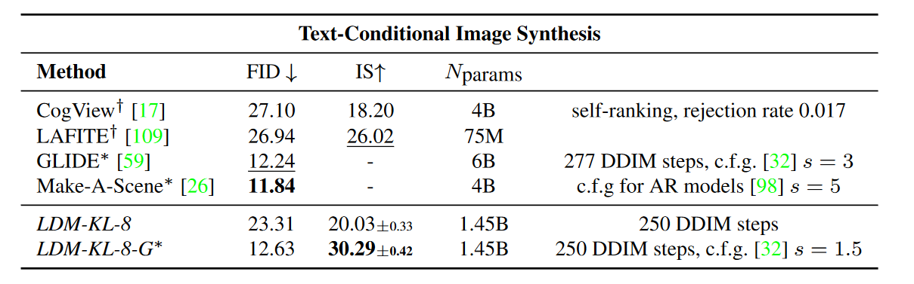

<a href="zotero://open-pdf/library/items/Z2AZZ32X?page=7">“We note that applying classifier-free diffusion guidance [32] greatly boosts sample quality, such that the guided LDM-KL-8-G is on par with the recent state-of-the-art AR [26] and diffusion models [59] for text-to-image synthesis, while substantially reducing parameter count. ---- 我们注意到应用无分类器扩散引导 [32] 极大地提高了样本质量，因此引导的 LDM-KL-8-G 与最近最先进的 AR [26] 和扩散模型 [59] 相当] 用于文本到图像的合成，同时大大减少了参数数量。”</a> (<a href="zotero://select/library/items/SCXBYWQZ">Rombach 等, 2022, p. 7</a>)

#### layout-to-image

在OpenImages上训练基于语义图的图像生成在COCO上微调, 结果如下:

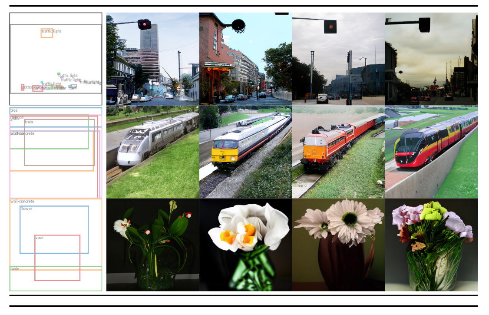

在附录中作者提及,在训练语义到图像生成的模型中,它们分别在MSCOCO和OpenImages上训练一个模型, 在OpenImages上训练的模型随后在COCO上微调, 直接在COCO上微调的模型表现和语义到图像SOTA接近,而在OpenImages上训练, 在COOC上微调的模型则超过SOTA

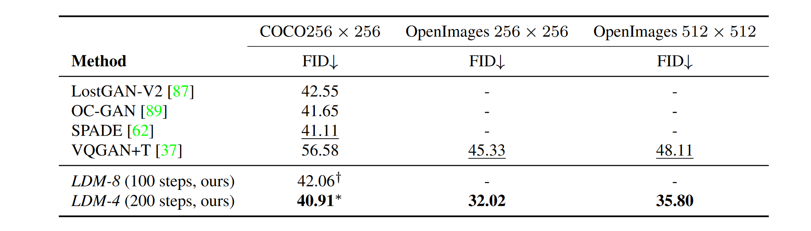

<a href="zotero://open-pdf/library/items/Z2AZZ32X?page=22">“Quantitative comparison of our layout-to-image models on the COCO [4] and OpenImages [49] datasets. †: Training from scratch on COCO; ∗: Finetuning from OpenImages. ---- 我们在 COCO [4] 和 OpenImages [49] 数据集上的布局到图像模型的定量比较。 †：在 COCO 上从零开始训练； ∗: 来自 OpenImages 的微调。”</a> (<a href="zotero://select/library/items/SCXBYWQZ">Rombach 等, 2022, p. 22</a>)

### image2image

通过将空间对齐条件信息输入到$\epsilon_\theta$ ,LDM可以有效的完成其它图像到图像的生成任务,包括语义合成, 图像超分辨率,图像修补等

#### 语义生成

使用和语义配对的风景图, 讲语义图的下采样版本额$f=4$ 的潜在图像表示(使用VQ-正则)连接,从$384^2$ 上裁剪$256^2$ 进行训练, 发现可以推广到更大的分辨率,在以卷积方式进行评估的时候可以生成高达数百万分辨率的图像, 在后面的图像超分辨率和图像修补中也使用了卷积采样的特性,得到了$512^2,1024^2$ 的图像.

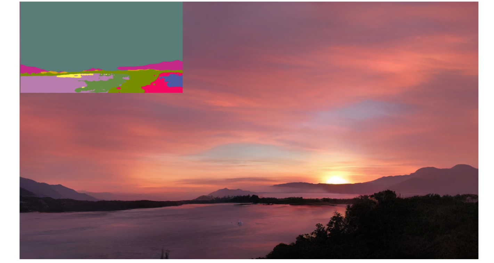

<a href="zotero://open-pdf/library/items/Z2AZZ32X?page=7">“A LDM trained on 2562 resolution can generalize to larger resolution (here: 512×1024) for spatially conditioned tasks such as semantic synthesis of landscape images. ---- 在 2562 分辨率上训练的 LDM 可以推广到更大的分辨率（这里：512×1024），用于空间条件任务，例如风景图像的语义合成。”</a> (<a href="zotero://select/library/items/SCXBYWQZ">Rombach 等, 2022, p. 7</a>)

由潜在空间方差引起的信噪比($Var(z)/\sigma_t^2$)会显著影响卷积采样的结果.例如, 直接在KL正则的潜在空间训练LDM,信噪比非常高,以至于模型在反向去噪过程中分配了大量语义细节; 相比之下, 当通过潜在变量的分量标准差重新缩放潜在空间时, SNR就减少了, 下图说明了对语义图像合成的卷积采样带来的影响, VQ正则化空间的方差接近1, 不必重新缩放.

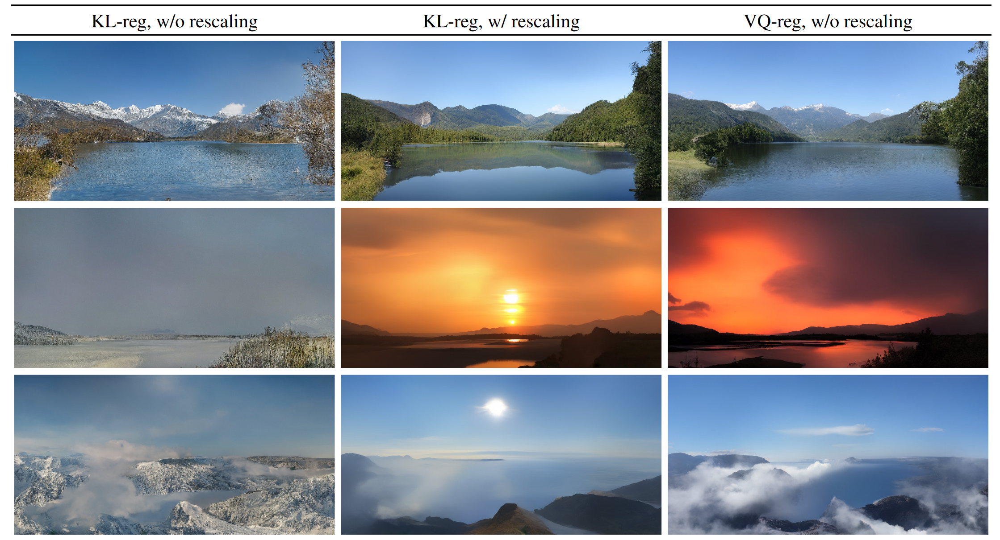

#### 图像超分辨率

以低分辨率的图像为条件, LDM可以生成高分辨率图像.

在第一个实验中, 分别按照SR3(图像超分辨率的研究),和使用 4 倍下采样的双三次插值法在按照SR3处理数据的方法处理的ImageNet数据上训练的LDM-SR,来做图像超分辨率,LDM-SR 使用在OpenImages数据集上使用VQ正则$f=4$ 训练的第一阶段模型, 将低分辨率图像作为条件输入$y$, 使用恒等映射作为$\tau_\theta$ 编码器,得到UNet的输入.实验的结果如下图:

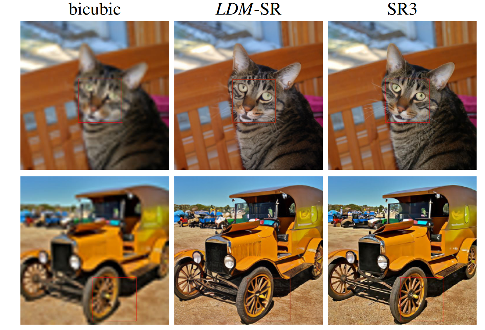

<a href="zotero://open-pdf/library/items/Z2AZZ32X?page=8">“Figure 10. ImageNet 64→256 super-resolution on ImageNet-Val. LDM-SR has advantages at rendering realistic textures but SR3 can synthesize more coherent fine structures. See appendix for additional samples and cropouts. SR3 results from [72]. ---- 图 10.ImageNet-Val 上的 ImageNet 64→256 超分辨率。 LDM-SR 在渲染逼真纹理方面具有优势，但 SR3 可以合成更连贯的精细结构。有关其他示例和裁剪，请参阅附录。 SR3 来自 [72]。”</a> (<a href="zotero://select/library/items/SCXBYWQZ">Rombach 等, 2022, p. 8</a>)

LDM-SR 在 FID 中优于 SR3，而 SR3 具有更好的 IS, 但是一个简单的图像回归模型获得了最高的 PSNR 和 SSIM 分数, 因为这些指标与人类感知并不一致,相比于不完全对齐的高频细节,这些指标更偏好模糊.

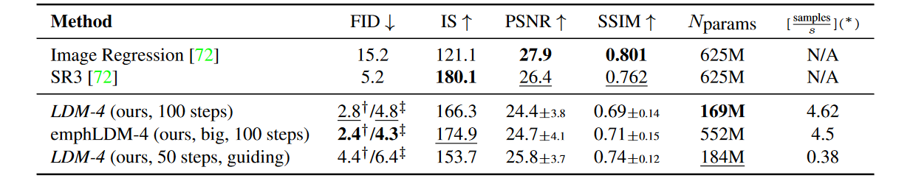

<a href="zotero://open-pdf/library/items/Z2AZZ32X?page=8">“Table 5. ×4 upscaling results on ImageNet-Val. (2562); †: FID features computed on validation split, ‡: FID features computed on train split; ∗: Assessed on a NVIDIA A100 ---- 表 5. ImageNet-Val 上的×4 放大结果。 (2562); †：在验证分割上计算的 FID 特征，‡：在训练分割上计算的 FID 特征； ∗: 在 NVIDIA A100 上评估”</a> (<a href="zotero://select/library/items/SCXBYWQZ">Rombach 等, 2022, p. 8</a>)

bicubic degradation 双三次插值退化是指一种图像处理方法，主要用于减少图像放大或缩小后的锯齿（像素误差）。双三次插值退化通过对图像进行双三次插值，然后再进行降采样，以实现平滑和缩放图像的目的。这种方法可以保留图像的细节，并且可以生成较为平滑的图像。

为了评估LDM-SR的泛化性, 在从类条件ImageNet模型用LDM采样和从网上抓取的图片上应用LDM-SR,发现只在SR3中双立方下采样条件进行训练的LDM-SR, 不能很好的泛化到不遵循此预处理的图像.因此, 为了得到泛化性更好的超分辨率模型,处理真实世界更复杂的情况, 包括相机噪声, 压缩伪影, 模糊和插值, 将LDM-SR中双立方下采样替换为Designing a practical degradation model for deep blind image super-resolution中处理图像退化的算法.BSR退化是将JPEG压缩噪声, 相机传感器早会僧, 用于下采样的不同图像差值, 高斯模糊核和高斯噪声以随机顺序应用到图像的处理流程, 使用Designing a practical degradation model for deep blind image super-resolution中原始参数的bsr退化过程会导致更强的退化过程,但是更温和的退化过程更适合LDM, 因此对BSR的参数进行调整, 具体可以看代码,实验的结果如下图所示: 

<a href="zotero://open-pdf/library/items/Z2AZZ32X?page=23">“Figure 18. LDM-BSR generalizes to arbitrary inputs and can be used as a general-purpose upsampler, upscaling samples from a classconditional LDM (image cf . Fig. 4) to 10242 resolution. In contrast, using a fixed degradation process (see Sec. 4.4) hinders generalization. ---- 图 18. LDM-BSR 泛化到任意输入，可用作通用上采样器，将来自类条件 LDM（图像参见图 4）的样本放大到 10242 分辨率。相反，使用固定的退化过程（参见第 4.4 节）会阻碍泛化。”</a> (<a href="zotero://select/library/items/SCXBYWQZ">Rombach 等, 2022, p. 23</a>)

以上是关于这篇论文主要的介绍, 包括研究的背景, 主要的方法, 主要实验结果和结论.
